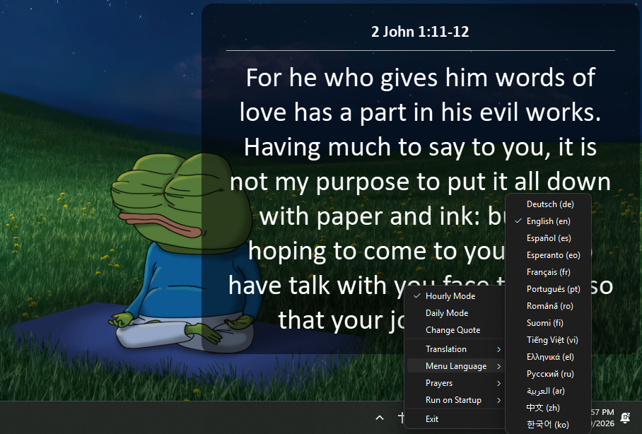

# Bible Widget

A transparent desktop widget that displays Bible verses on your screen. It sits on top of everything, stays out of the way, and gives you a new verse every hour (or daily if you prefer).




## Features

- **Transparent overlay** — blends into your desktop, just shows the verse
- **Drag anywhere** — click and drag to move it wherever you want
- **Smart anchoring** — drag it where you want, and the window stays centered there even when the verse changes size
- **19 Bible translations** — 14 languages: Arabic, Chinese (×2), German, Greek, English (×2), Esperanto, Spanish, Finnish (×2), French, Korean, Portuguese (×3), Romanian, Russian, Vietnamese
- **Menu Language picker** — right-click the tray icon to change the tray menu text to any of 14 languages, independent from your Bible translation
- **Prayers** — right-click the tray icon → Prayers → "The Lord's Prayer" to open a dedicated overlay with Amen button
- **Hourly mode** — shows a random passage every hour
- **Daily mode** — shows the same verse all day (changes at midnight)
- **Change Quote** — instantly get a new verse from the tray menu
- **Run on Startup** — toggle in the tray menu to auto-launch when you log in. Survives folder renames — no broken paths.
- **Translation and Menu Language save automatically** — your Bible selection and menu language are remembered between launches
- **Stats for Nerds** — run `start_widget.bat` to see uptime, verse count, and other stats in a terminal
- **Works offline** — all Bible data bundled locally, no internet needed after setup

## Requirements

- **Windows** (10 or 11)
- **Python 3.8+** installed with "Add Python to PATH" checked
- **PySide6** (run `dependencies.bat` to install it automatically)

## Quick Start

1. Run `dependencies.bat` — this installs PySide6 if you don't have it
2. Double-click `start_widget_no_terminal.vbs` to launch the widget (no terminal window)
3. Right-click the cross icon in your system tray to change modes, pick a translation, change the menu language, open prayers, or exit

### Alternative launch

- `start_widget.bat` — launches with a terminal showing stats (verbose mode)
- `stop_widget.bat` — kills the widget if needed

## Files

| File | What it does |
|------|-------------|
| `dependencies.bat` | Check/install PySide6 |
| `start_widget_no_terminal.vbs` | Launch widget silently |
| `start_widget.bat` | Launch widget with stats terminal |
| `stop_widget.bat` | Stop the widget |
| `widget_window.py` | The main widget code |
| `prayer_window.py` | The Lord's Prayer overlay window |
| `menu_strings.py` | Tray menu text translations (14 languages) |
| `bible_loader.py` | Loads Bible data and picks verses |
| `bibles/` | All 19 Bible JSON files + index.json (~75 MB) |
| `prayers/` | The Lord's Prayer in all 19 translations |
| `translation.txt` | Saved Bible translation preference |
| `language.txt` | Saved menu language preference |

## How It Works

The widget loads all 19 translations at startup (~75 MB in memory). Each time a new verse is requested, it picks a random book, chapter, and starting verse, then grabs 1-5 consecutive verses. The window automatically resizes to fit the text — long verses get smaller fonts and wrap to multiple lines.

In daily mode, the verse is seeded by the current date so everyone gets the same verse on the same day.

The tray menu can be displayed in any of 14 languages, independent from which Bible translation you're reading.

## Adding a New Translation

Place a Bible JSON file in the `bibles/` folder. The widget auto-discovers it on next launch. The file should follow one of these formats:

**Standard format (most Bibles):**
```json
{
  "Genesis": {
    "1": {
      "1": "In the beginning...",
      "2": "And the earth..."
    }
  }
}
```

**Array format (like the Arabic Bible):**
```json
[
  {
    "name": "Genesis",
    "chapters": [
      ["In the beginning...", "And the earth..."],
      [...]
    ]
  }
]
```

If you add a new file, also add its info to `bibles/index.json` for proper display names:
```json
{
  "language": "English",
  "versions": [
    { "name": "My Translation", "abbreviation": "my_trans" }
  ]
}
```

## Adding a New Menu Language

Add a new entry to `LANGUAGES` in `menu_strings.py` with the 2-letter language code and all translated menu strings.

## License

<a href="https://github.com/puretechteam/bible-widget">Bible Widget</a> by <a href="https://github.com/puretechteam">Pure Tech</a> is marked <a href="https://creativecommons.org/publicdomain/zero/1.0/">CC0 1.0 Universal</a>

All Bible texts are public domain. JSON data sourced from [thiagobodruk/bible](https://github.com/thiagobodruk/bible) (CC0).